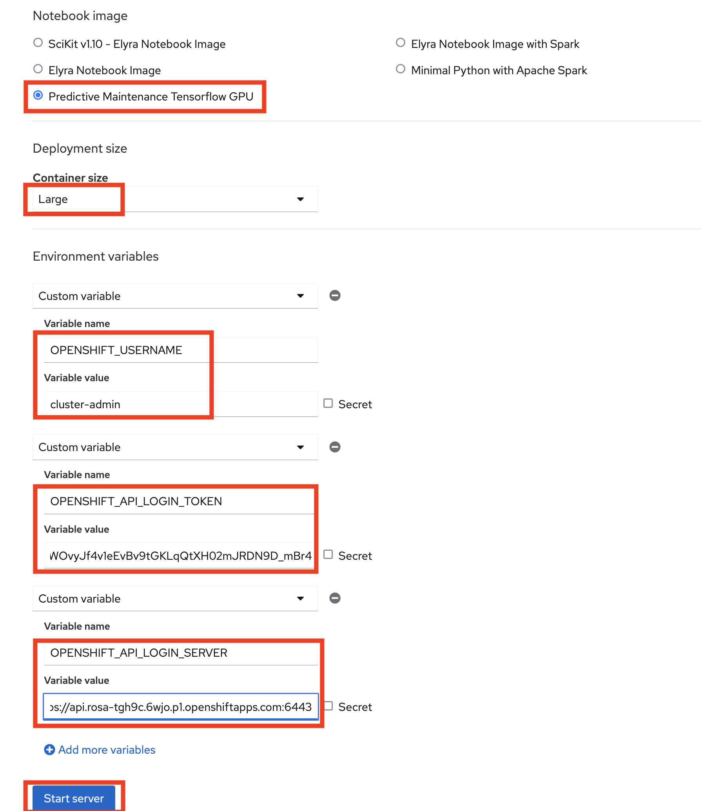
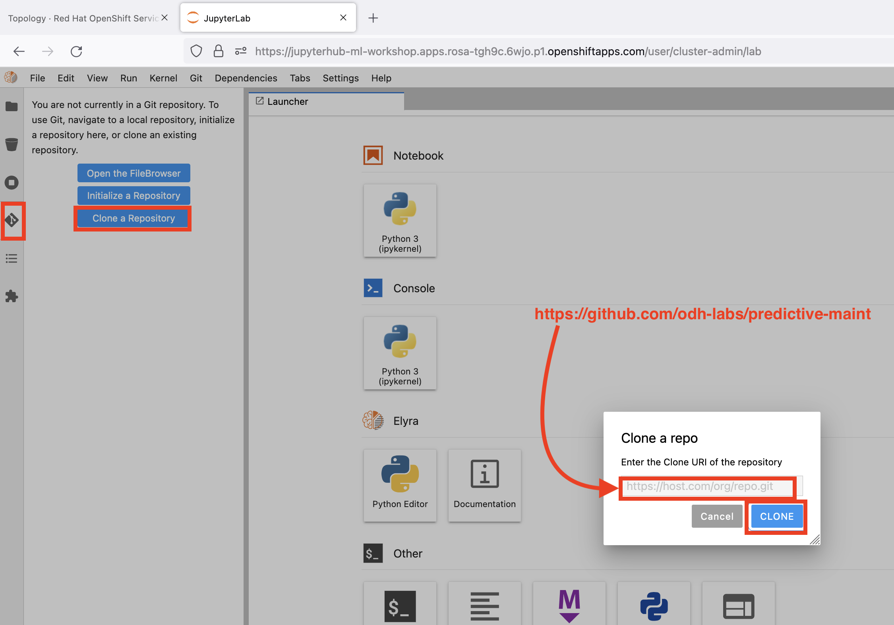
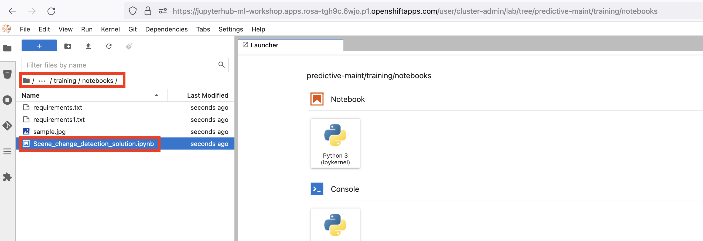
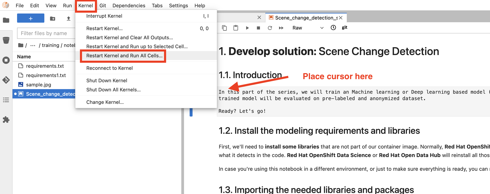
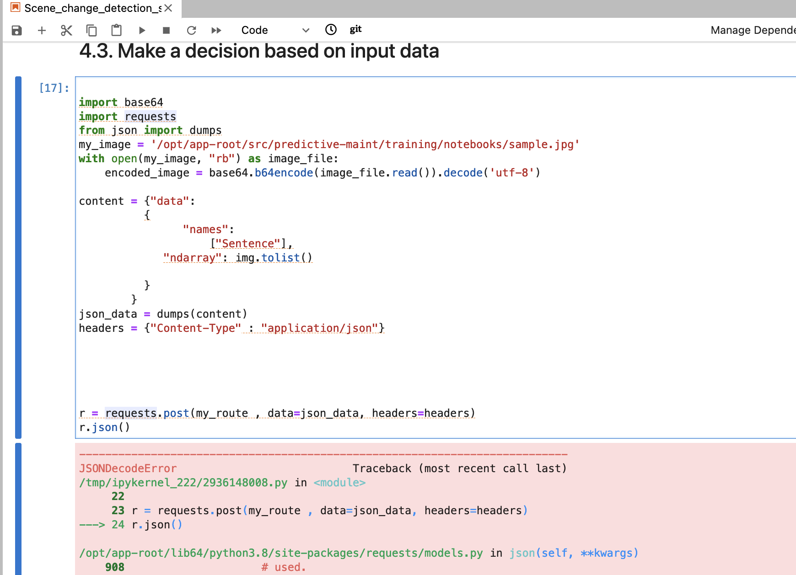
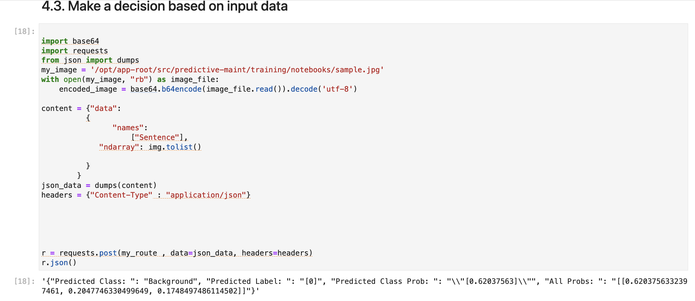
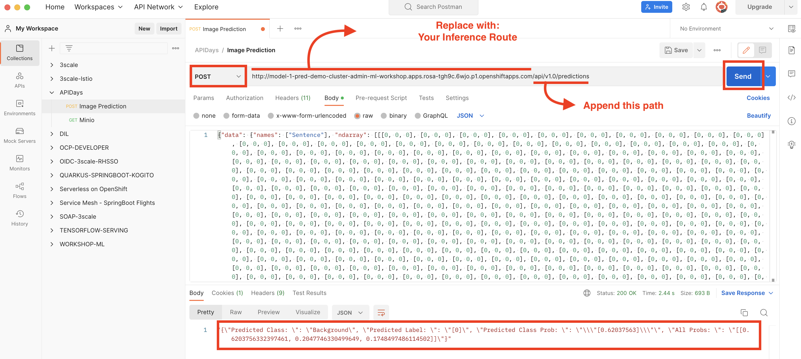

# Runnning the AI Model Training Demo

We are going to create, train and deploy an equivalent model we used previously to detect objects in the realtime streaming images from our webcam via Kafka.
We're enabling you to customise the AI Model you used in the earlier Demo section for your requirements. 

## 1 - Gather your OpenShift credentials which our Jupyter notebooks require
- Inside OpenShift, keep a note of your username on the right, in my case ***cluster-admin*** which we'll refer to as **OPENSHIFT_USERNAME**. Next, click the dropdown arrow beside your usename, then click **Copy login command**
   

- Follow the defaults to login then **Display Token** then you will see a screen like this:


Keep note of the 2 values, which we'll need along with your OPENSHIFT_USERNAME you got in the previous step. In summary we'll need these 3 values (yours will be different)

```
OPENSHIFT_USERNAME
cluster-admin

OPENSHIFT_API_LOGIN_TOKEN
sha256~9Q1R5WOvyJf4v1eEvBv9tGKLqQtXH02mJRDN9D_mBr4

OPENSHIFT_API_LOGIN_SERVER
https://api.rosa-tgh9c.6wjo.p1.openshiftapps.com:6443
```

## 2 - Open Jupyter Hub and download Github repository with data science code

- In OpenShift's Administrator view, navigate to **Networking > Routes**
   Click on the *jupyter* Route
   

- Login using your OpenShift credentials

- On the Authorise Access popup screen, click *Allow selected permissions*
   
   
- On the Spawner page
    - select the image **Predictive Maintenance Tensorflow GPU** 
    - select a Large size
    - add your 3 variables you got previously - with your values
    - click **Start Server**
    

A few minutes later, you'll be in. Do the following
- Click the Git icon on the left
- Click **Clone a Repository**
- Enter **https://github.com/odh-labs/predictive-maint** in the text box
- Click **Clone**

    

Shortly the repository files will have downloaded to your Jupyter. 

## 3 - Run the Scene_change_detection_solution.ipynb Jupyter notebook

In this section we allow you to customise the AI Model you used in the earlier Demo section for your requirements. 

The notebook we will use (**Scene_change_detection_solution.ipynb**) does the following:
- Installs required libraries
- Initialises its connection to S3 Object strage
- Reads our data that wil be used to train the model. We have pictures of people and other objects representing **Background**
- Does some preprocessing to modify our data prior to training
- Compiles and trains our model. Our models is built in the python file **predictive-maint/training/src/modules/build_model.py** using the off the shelf model *EfficientNetB0* from Tensorflow. We customise it by adding some layers to this off the shelf model.
- Deploy solution as an app with model serving tool Seldon. Using the open source tool Seldon we build a container, expose it using a RESTful API.
- This RESTful API is exposed as a Route in OpenShift.
- Finally we test that using a random image


To get going, do the following
- Navigate to **predictive-maint/training/notebooks/**
- Open the file **Scene_change_detection_solution.ipynb**
    

- Place the cursor in the first editable call on the right
- Choose menu item **Kernel > Restart and Run all Cells**
    
- Accept the warning by clicking **Restart**
    
- About 10 minutes later, your notebook should have run to completion, your model should be built and exposed using a route. That route is visible in the Administrator Section of OpenShift under **Networking Routes**. Note **your** route will have **your** username appended to the name. In my case **cluster-admin**
    
- Copy the Location URL of **Your Inference Route** . In my case though yours will be different: 
    ```
    http://model-1-pred-demo-cluster-admin-ml-workshop.apps.rosa-tgh9c.6wjo.p1.openshiftapps.com
    ```

## 4 - Troubleshooting

Ocasionally cell ***4.3. Make a decision based on input data*** fails - due to timing issues - with a Python error like shown.

If that happens, place the cursor in the cell and re-run it by clicking 

SHIFT+ENTER 

That should fix the issue and you should see a prediction:



## 5 - Testing the model

The best way to test the model is to upload your image - replacing 
```
predictive-maint/training/notebooks/sample.jpg
```
as used in cells
- ***4.2. Read the test data*** and
- ***4.3. Make a decision based on input data***
which calls the model via the API Seldon creates. Then re-run those cells by typing

SHIFT+ENTER 

Alternatively, you can use a tool like Postman
- create a POST Method
- paste in **Your Inference Route** that you retrieved a couple of steps back
- append this to the route
    ```
    /api/v1.0/predictions
    ```
- in the body section copy and paste [the 1s and 0s raw data here](https://raw.githubusercontent.com/odh-labs/predictive-maint/main/training/data/seldon-payload.txt)
This is the same type of numeric multi dimensional array our notebook uses when it does its perdiction.
- Click **Send**
- You should see a prediction at the bottom



## 5 - Customising the model for your purposes

To add your own data, navigate to the folder
```
predictive-maint/training/data/raw/data/
```
remove folders 
- Background
- Finger
- Person
then create a folder for what you want your model to detect and add multiple photos there. e.g. if you wanted to detect sharks and dolphins, create these folders and add images of those there

We also recommend more robust training. For simplicty, we only loop through our training data 3 times, with 3 epochs in cell ***1.8. Training the Model***. This should be much much higher - increase until you see no improved accuracy.


Congratulations - you've completed the lab!

